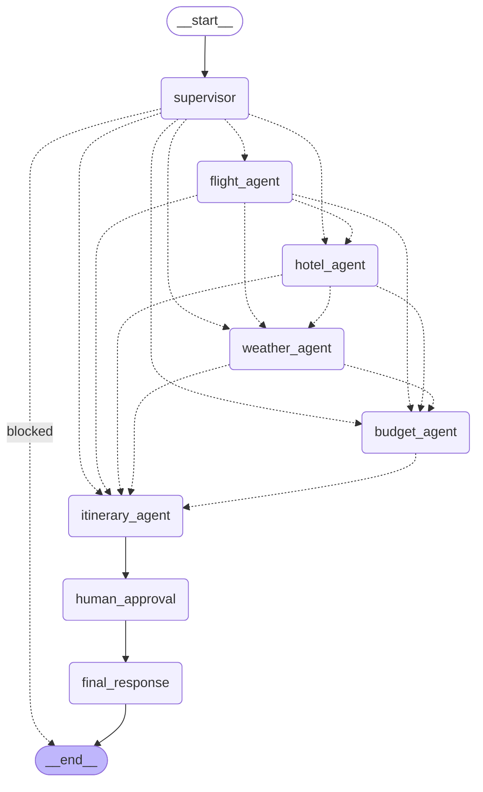

# Multi-Agent AI Travel Planning System

A travel planning system built on LangGraph, in which a **supervisor agent** decides at
runtime which specialist agents a request needs, every specialist gathers live data
through **Model Context Protocol (MCP) servers** rather than hand-written API clients, an
**input guardrail** screens requests before any of them run, and a **human reviews the
draft plan** before it is finalised.

Results are served by a FastAPI backend and presented in a React and TypeScript frontend
that shows the routing decision, which agents were skipped and why, and the approval gate.

---

## What makes this multi-agent rather than a pipeline

Nothing in the workflow is hard-wired. Every specialist leaves through a conditional edge
that asks the same question: given the supervisor's plan, which agent runs next?

| Request | Agents that run |
|---|---|
| `What is the weather in Tokyo?` | weather, itinerary |
| `Plan 4 days in Dubai from Karachi, budget 150000 PKR` | flight, hotel, budget, itinerary |
| `Write me a linked list in Python` | none, the guardrail stops it |

The guardrail exits straight to the end of the graph, so a rejected request costs one
model call instead of five agents' worth of paid API requests.



Regenerate this diagram at any time with `python graph.py`.

---

## Architecture

```
Browser (React 19 + TypeScript)
    |  POST /api/plan          run until the approval node suspends the graph
    |  POST /api/approve       resume the same run with the reviewer's answer
    v
FastAPI  (api.py)
    v
LangGraph  (graph.py -> agents.py -> state.py)
    |
    |-- Supervisor        input guardrail, then dynamic agent selection
    |-- Flight Agent      -> AviationStack MCP server  (local, stdio)
    |-- Hotel Agent       -> Tavily MCP server         (remote, streamable HTTP)
    |-- Weather Agent     -> Weather MCP server        (local, stdio, written here)
    |-- Budget Agent      -> Groq LLM over the other agents' findings
    |-- Itinerary Agent   -> draft plan for review
    |-- Human Approval    -> interrupt(), waits for a person
    |-- Final Response    -> honours approval or rewrites from feedback
    v
PostgreSQL  (checkpoints: suspended runs and per-thread run history)
```

### The three MCP servers

| Server | Transport | Origin | Tools used |
|---|---|---|---|
| Tavily | Remote, streamable HTTP | Hosted by Tavily | `tavily_search` |
| AviationStack | Local subprocess, stdio | [Pradumnasaraf/aviationstack-mcp](https://github.com/Pradumnasaraf/aviationstack-mcp) | `list_airports`, `list_airlines` |
| Weather | Local subprocess, stdio | `weather_mcp_server.py` in this repo | `get_current_weather`, `get_forecast` |

Tools are discovered at runtime, so adding a server changes no agent code. Run
`python check_mcp_servers.py` to see every tool the system can currently reach.

---

## Why human-in-the-loop makes this a two-call API

One HTTP request cannot both produce a draft and collect a person's verdict on it, so the
run is split at the approval node. `interrupt()` suspends the graph and LangGraph writes
its exact position to PostgreSQL. `POST /api/approve` later resumes it with
`Command(resume=...)`, on a different worker thread and potentially minutes later.
`thread_id` is the only thing linking the two calls, which is also why a page reload can
recover a pending draft through `GET /api/thread/{thread_id}`.

---

## Project layout

```
Multi Agent System Demo/
├── config.py                 # env, model factory, MCP server locations
├── state.py                  # TravelState, the shared object every node reads
├── mcp_client.py             # one MCP client over three servers, plus tool wrappers
├── agents.py                 # the eight graph nodes
├── graph.py                  # nodes, conditional edges, PostgreSQL checkpointer
├── weather_mcp_server.py     # custom MCP server for OpenWeatherMap
├── api.py                    # FastAPI, two-phase planning endpoints
├── main.py                   # CLI entry point, same graph
├── check_mcp_servers.py      # MCP connectivity and tool discovery check
├── tests/
│   └── test_workflow.py      # end-to-end checks: guardrail, routing, HITL, checkpoints
├── frontend/
│   └── src/
│       ├── api/travel.ts             # the only module that calls the backend
│       ├── components/
│       │   ├── SearchBar.tsx         # request form
│       │   ├── SupervisorPlan.tsx    # routing decision and extracted constraints
│       │   ├── AgentStep.tsx         # one pipeline step, including skipped
│       │   ├── ApprovalPanel.tsx     # the human-in-the-loop gate
│       │   └── ResultsPanel.tsx      # layout for a whole run
│       └── App.tsx                   # two-phase flow
├── requirements.txt
├── .env.example
└── README.md
```

---

## Setup

### Prerequisites

- Python 3.10 or newer for the app, and Python 3.13 or newer for the AviationStack MCP server
- Node.js 18 or newer
- A running PostgreSQL instance
- `uv` for installing the AviationStack server: `pip install uv`

### 1. Python environment

```bash
python -m venv LangGraphenv
LangGraphenv\Scripts\activate          # Windows
source LangGraphenv/bin/activate       # Linux or macOS
pip install -r requirements.txt
```

### 2. Database

```sql
CREATE DATABASE langgraph_memory_demo;
```

LangGraph creates its own checkpoint tables on first run.

### 3. Credentials

Copy `.env.example` to `.env` and fill in the keys.

| Variable | Where to get it | Needed for |
|---|---|---|
| `GROQ_API_KEY` | [console.groq.com](https://console.groq.com) | every agent |
| `TAVILY_API_KEY` | [tavily.com](https://tavily.com) | hotel search |
| `AVIATIONSTACK_API_KEY` | [aviationstack.com](https://aviationstack.com/signup/free) | flight data |
| `OPENWEATHER_API_KEY` | [openweathermap.org/api](https://openweathermap.org/api) | weather |
| `DATABASE_URL` | your PostgreSQL instance | checkpoints and approval resume |

A missing key degrades one section of the plan rather than failing the run. The frontend
reads `/api/health` on load and warns about any MCP server that could not start.

### 4. AviationStack MCP server

It needs its own environment because it requires Python 3.13.

```bash
git clone https://github.com/Pradumnasaraf/aviationstack-mcp.git
cd aviationstack-mcp
uv sync
```

Keep it at `aviationstack-mcp/` inside the project. `config.py` finds the interpreter
relative to the repository root, so no absolute paths need editing.

### 5. Frontend

```bash
cd frontend
npm install
```

### 6. Check the MCP servers

```bash
python check_mcp_servers.py
```

---

## Running

Two terminals.

```bash
# Terminal 1, from the project root
uvicorn api:server --reload --port 8000
```

```bash
# Terminal 2, from frontend/
npm run dev
```

Open <http://localhost:5173>.

There is also a CLI that drives the same graph, including the approval prompt:

```bash
python main.py
python main.py --thread mehdi     # reattach to an existing thread
```

### Using the app

1. Enter a **session name**. It is the thread id. It scopes the checkpoint, so a reload
   recovers a pending draft. It does not yet carry earlier turns into new prompts. See
   Known limitations.
2. Describe the trip. Be specific about destination, dates, budget, and preferences.
3. The supervisor panel shows which specialists it scheduled and which it skipped.
4. Review the draft, then **approve** it or **request changes** with feedback.
5. Approving polishes the draft. Requesting changes has the final agent rewrite it.

---

## Shared state

Every node reads and writes one `TravelState` dictionary. Only `messages` accumulates;
other keys are replaced by the node that owns them. The type is `total=False` because the
supervisor decides at runtime which keys get populated, so readers use `.get()` rather
than indexing.

| Field | Written by | Purpose |
|---|---|---|
| `messages` | every node | conversation history, appended not replaced |
| `user_id`, `user_query` | caller | the request |
| `guardrail_blocked`, `guardrail_reason` | supervisor | guardrail verdict |
| `selected_agents` | supervisor | drives every conditional edge |
| `supervisor_reasoning` | supervisor | why those agents |
| `trip_constraints` | supervisor | destination, origin, duration, budget, style |
| `flight_results` | flight agent | airports, airlines, fare guidance |
| `hotel_results` | hotel agent | accommodation and neighbourhoods |
| `weather_results` | weather agent | current conditions and forecast |
| `budget_results` | budget agent | cost feasibility |
| `itinerary` | itinerary agent | the draft under review |
| `approval_request` | itinerary agent | what the reviewer is asked |
| `approved`, `human_feedback` | human approval | the reviewer's answer |
| `final_response` | final agent | the plan the user reads |
| `llm_calls` | several | simple cost counter |

---

## API

| Method | Path | Purpose |
|---|---|---|
| `POST` | `/api/plan` | Run the guardrail, supervisor, and selected specialists. Stops at approval. |
| `POST` | `/api/approve` | Resume the suspended run with `approved` and `feedback`. |
| `GET` | `/api/thread/{thread_id}` | Read a thread's latest checkpoint, including a pending draft. |
| `GET` | `/api/health` | Model in use and which MCP servers started. |

Interactive documentation is at <http://localhost:8000/docs>.

---

## Tests

```bash
python tests/test_workflow.py
```

These are integration tests. They call Groq, the MCP servers, and PostgreSQL, and cover
the behaviour that is easy to break:

- the guardrail rejects off-topic and empty requests, and stops the graph rather than
  letting it run on to the approval node
- an empty request is rejected without spending a model call
- a weather-only request routes to two agents and produces no flight output
- a full trip request runs several specialists and suspends for approval
- resuming with a rejection and feedback produces a plan that differs from the draft
- the PostgreSQL checkpoint retains the thread after the run

---

## Tech stack

| Layer | Technology |
|---|---|
| Orchestration | LangGraph, conditional edges, `interrupt()` |
| Tool protocol | Model Context Protocol via `langchain-mcp-adapters` and `mcp` |
| LLM | Groq, `openai/gpt-oss-120b` by default, set `GROQ_MODEL` to change it |
| Flight data | AviationStack, through a local MCP server |
| Web and hotel search | Tavily, through a remote MCP server |
| Weather | OpenWeatherMap, through an MCP server written in this repo |
| State and checkpoints | PostgreSQL via `PostgresSaver` over a `ConnectionPool` |
| Backend | FastAPI, Uvicorn, Pydantic |
| Frontend | React 19, TypeScript, Vite, Lucide icons |

---

## Engineering notes

A few decisions worth knowing about, since they are the parts most likely to be changed
by someone extending this.

- **The guardrail fails closed.** If it cannot reach a verdict the request is refused,
  because the alternative is running five agents and spending API quota on input nothing
  has validated. Routing, by contrast, fails open: a request the guardrail already
  accepted falls back to running every specialist.
- **The supervisor's agent list is normalised, not trusted.** Unknown names are dropped,
  the canonical running order is restored, and the itinerary agent is always included,
  because it is the node that produces the plan the user actually reads.
- **MCP responses are unwrapped, not stringified.** Tool results arrive as typed content
  blocks. Passing them through `str()` leaves a Python repr full of escaped newlines in
  both the UI and the next agent's prompt, so `mcp_client.py` flattens the blocks and
  renders search responses as a readable list.
- **Prompt sections are clipped to a stated budget.** Groq's free tier caps a single
  request at its tokens-per-minute allowance, and that cap counts the reserved output
  tokens too. The draft itinerary is the one input that regularly runs past 8,000
  characters, so it gets its own allowance in `agents.py`. Left unclipped it pushes the
  final call over the limit, which fails a run at the last node after every other agent
  has already been paid for.
- **A connection pool, not a single connection.** FastAPI serves requests from a thread
  pool and psycopg connections are not safe to share across threads.
- **Each conditional edge declares only the destinations it can reach.** Handing every
  node the full route map still runs correctly but claims edges that can never be taken,
  which then show up in the rendered diagram.

---

## Known limitations

Written down deliberately, because each of these is a real gap and finding them yourself
is faster than discovering them by poking at the code.

**Not agentic in the strict sense.** There is exactly one genuine decision in the system:
the supervisor's routing call, and that is a single-shot JSON classification rather than an
agent loop. No node is given a tool list and left to choose. Two of the five specialists,
hotel and weather, contain no model call at all. This is accurately an LLM workflow with an
LLM router, and the word "multi-agent" is doing some work.

**The specialists run sequentially when three of them could run in parallel.** Flight,
hotel, and weather read only `user_query` and `trip_constraints`, so they are independent
and belong in a fan-out. `route_from_supervisor` returns a single node name, so the whole
`AGENT_ORDER` walk exists to schedule them one at a time. Before parallelising,
`llm_calls` must become `Annotated[int, operator.add]`, because two branches writing a
plain `int` in the same superstep raise `InvalidUpdateError`.

**No streaming, so the UI overstates progress.** `api.py` uses `.invoke()`, so the client
waits for the whole run. While it waits, every agent card shows as running, including the
ones the supervisor skipped. `stream_mode="updates"` over server-sent events would give
real per-node transitions.

**The flight agent's tool use is shallow.** `list_airlines("")` returns ten arbitrary
global airlines unrelated to the route, and `list_routes` is defined in `mcp_client.py` and
never called. Strip the AviationStack tools out and the flight guidance barely changes.

**Thread ids are an unauthenticated capability.** There is no auth, no rate limiting, and
no ownership check. Anyone who guesses a thread id can read that plan through
`GET /api/thread/{id}` or approve it through `POST /api/approve`. Since the id is a
hand-typed session name, guessing is easy. Server-generated identifiers would remove the
enumeration; real multi-tenancy needs an ownership table.

**Tool output is not treated as untrusted.** Search results are third-party web content and
they are interpolated into the budget, itinerary, and final prompts with no fencing and no
instruction to treat them as data. The guardrail screens the user, not the web. Indirect
prompt injection through a page that ranks for a hotel query is unmitigated.

**Conversation memory is not implemented.** `messages` accumulates in the checkpoint but no
node ever reads it and no prompt includes it, so a returning thread gets no benefit from
its history. The checkpointer is doing real work for approval resume and reload recovery;
it is not yet doing memory.

**Import-time side effects.** `agents.py` builds the model and `graph.py` opens the pool and
runs setup at import, so the modules cannot be imported without every credential and a live
database. That is also why the tests are all integration tests: the deterministic logic that
is easiest to test, routing, JSON extraction, clipping, selection normalising, has no unit
tests, and there is no CI.

**No version pins, and the tested interpreter is not the documented one.**
`requirements.txt` pins nothing while the code depends on `interrupt`, `StateSnapshot`, and
`langchain-mcp-adapters` session semantics. Development was on Python 3.14.

---

## License

MIT. See [LICENSE](LICENSE).
